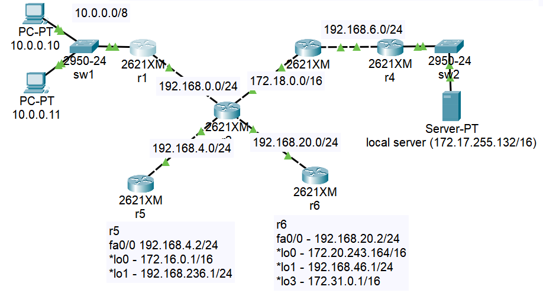

# Урок 2. Технология Ethernet. Протокол IP.

1. Настроить сеть согласно схеме в файле https://disk.yandex.ru/d/1m4aUoqDm1SKBQ

2. Проверить работоспособность соседних между собой сетей командой ping. Понять почему один роутер отвечает, а другой нет.

ping прошел

ping не прошел, так как не настроена Static Routes

проверка соответствия mac-адреса и ip-адреса

3. Обвести синим все broadcast домены

4. * Настроить loopback интерфейсы.

