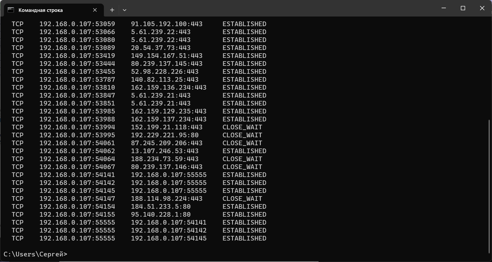
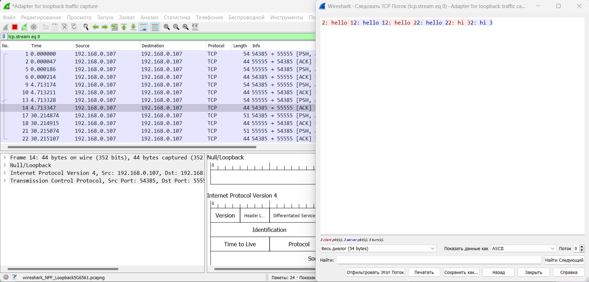

#Урок 6. Основы компьютерных сетей. Транспортный уровень. UDP и TCP.

1. Напишите свою программу сервер и запустите её. (если опыта в python нет, запустите готовый код и разберитесь, как он работает - файл с кодом готового клиента: https://disk.yandex.ru/d/cAfsjjG_mLqF3A файл с кодом готового сервера: https://disk.yandex.ru/d/qrj4qpiXhXVwgw )

1.** попробуйте улучшить код, опишите что сделали, какие фичи добавили.

2. Запустите несколько клиентов. Сымитируйте чат.

3. Отправьте мне код написанного сервера (можете через github, если удобно или прямо здесь в txt формате) и скриншоты работающего чата.

[client.py](https://github.com/NadezhdaUimina/Computer-networks/blob/main/client.py)

[server.py](https://github.com/NadezhdaUimina/Computer-networks/blob/main/server.py)

4. Отследите сокеты с помощью команды netstat. (тоже пришлите скриншот именно сокетов вашего чата)

5. Перехватите трафик своего чата в Wireshark и cшейте сессию. Пришлите скриншот сшитой сессии с диалогом.

