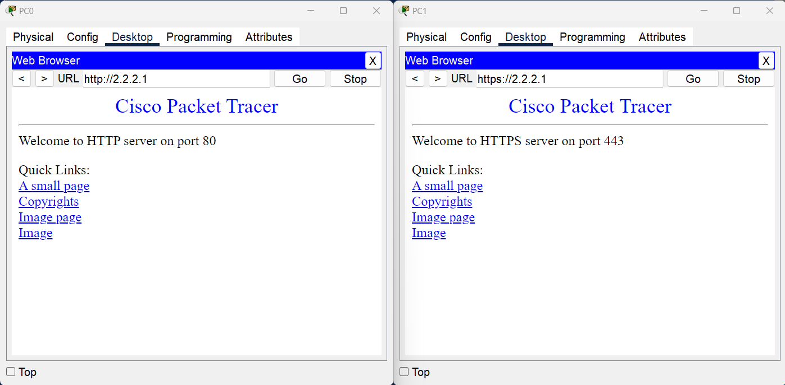
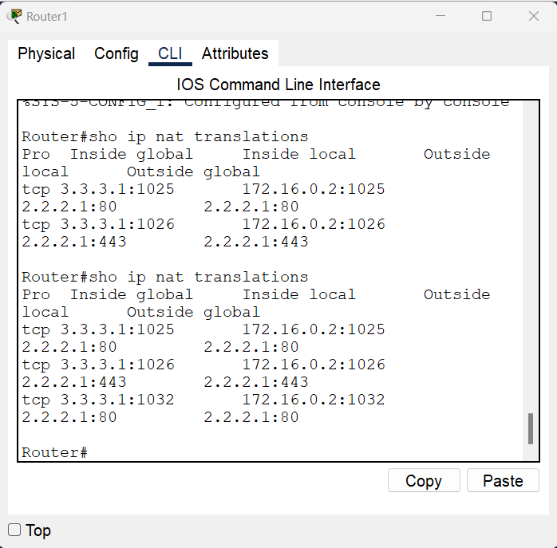
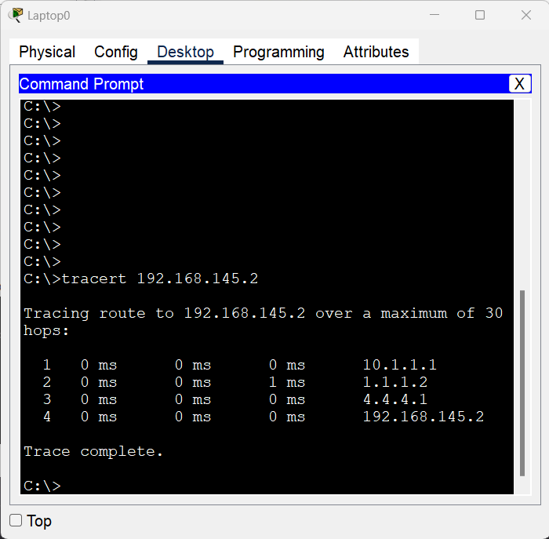

# Урок 7. NAT. GRE.

Условие:

1. Настроить сеть согласно схеме в файле https://disk.yandex.ru/d/hegGC7woXSjz0g где:

Office 1 - cеть 10.1.1.0/24

Office 2 - cеть 10.0.0.0/16

Office 3 - cеть 172.16.0.0/16

Office 4 - cеть 192.168.145.0/24

Где “Интернет” - там имитация Интернета с помощью OSPF, выберите сами публичные сети между роутерами.

Задача 1. Настроить на Port Forwarding на сервера в Office 2. Server0 должен предоставлять HTTP по 80му порту, а Server1 должен предоставлять HTTPS по 443 порту. Странички должны быть разные.

Задача 2. Настроить PAT в Office 3 для компьютеров, чтобы они выходили в интернет под одним публичным IP адресом на Router1.

Предоставить скриншот открытых страниц по HTTP и HTTPS по публичному адресу Router3 в веб-браузере клиентов Office3 (с РС1 и РС0)

После чего предоставить вывод show ip nat translation c Router1.

Задача 3. Связать сети Office 1 и Office 4 с помощью GRE. Предоставит трейс с Laptop0 до Server2.

Задача 4. Доделать OpenVPN (или Wireguard) если не успели. Предоставит скриншот публичного IP до и после подключения через VPN + скриншот вывода команды ip addr.
Учтите что в Yandex Cloud есть два нюанса:

- если создавать прерываемую машину, то публичный адрес будет меняться после перезапуска

- на машине Yandex делает приватный IP, но одновременно в виртуализации создается Static NAT 1:1 в ваш публичный IP.

