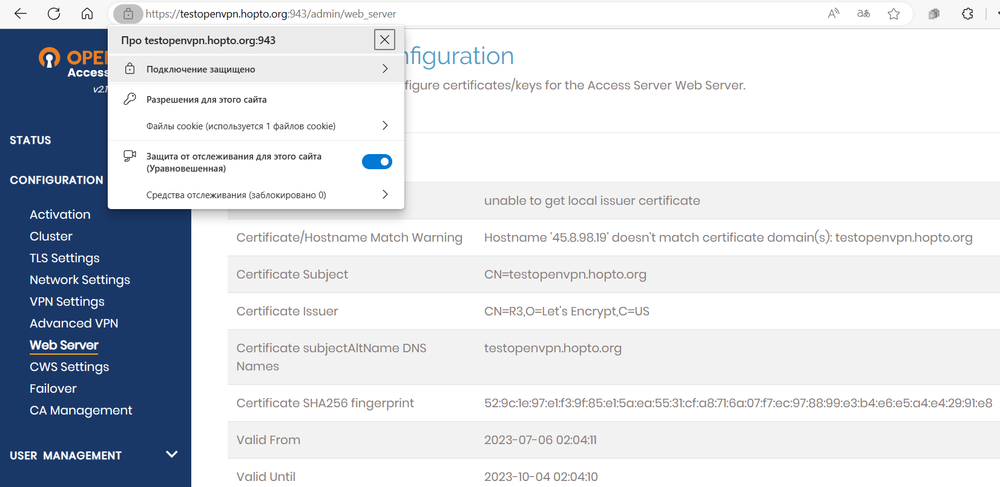
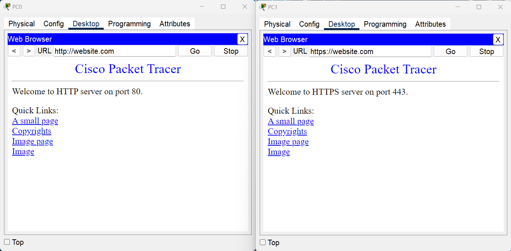
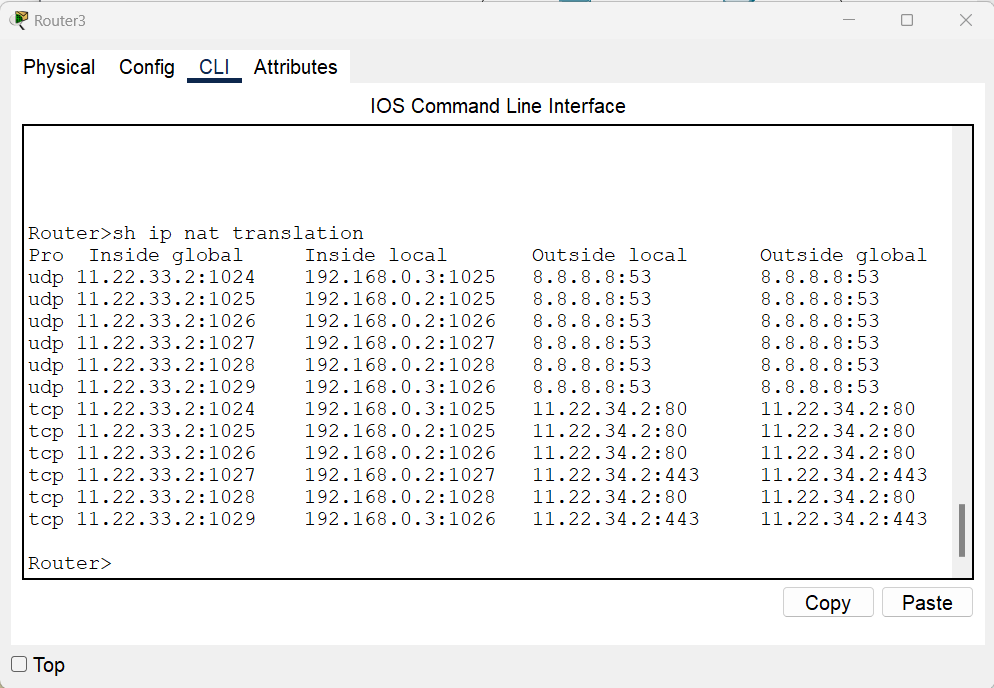
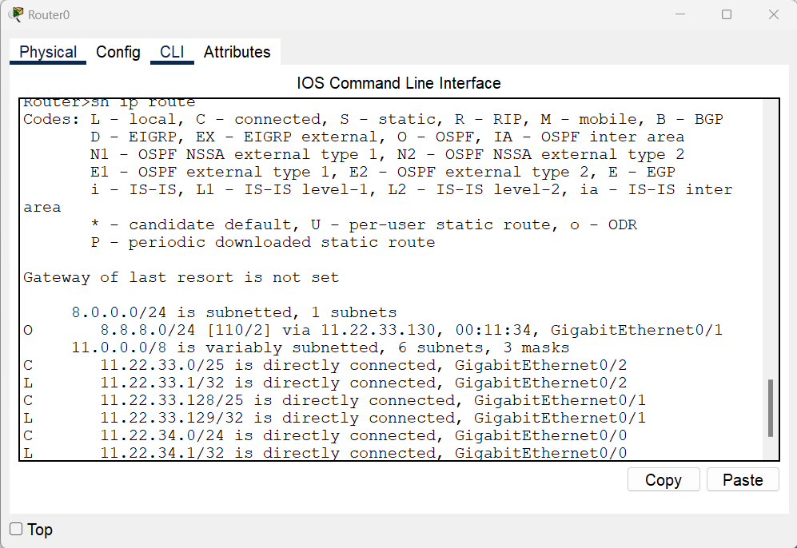

# Урок 8. Основы HTTP/HTTPS и DNS

Доделать свой сертификат

Настроить сеть согласно информации на схеме (https://disk.yandex.ru/d/Vaxkf2X0RG9NGw .)

[homework.pkt](https://github.com/NadezhdaUimina/Computer-networks/blob/main/homework.pkt)

Сымитировать "Интернет" с помощью OSPF. Приватных сетей в маршрутизации быть не должно.

Для компьютеров из Office 1 предоставить доступ в "Интернет" с помощью PAT.

Открыть доступ из "Интернета" к серверам из Office 2 c помощью Port Forwarding.

Для компьютеров из Office 1 должны открываться разные сайты по HTTP и HTTPS из Office 2 по одному доменному имени.

Предоставить скриншоты открытых разных сайтов по одному доменному имени.

Предоставить скриншот таблицы NAT трансляций с Router3.

Предоставить скриншот таблицы маршрутизации с Router0.

